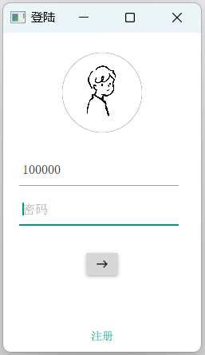

# DingDong

### 1 Introduction

---

This is a chat software designed based on Qt QtQuick QML, which can provide remote communication with friends from all over the world.

The application scenarios of this project are office, entertainment, daily life, etc., to maintain smooth information flow at all times. In the project, I mainly referred to the relevant functions of WeChat for development.

### 2 Project Design

---

#### 2.1 Environment

**Client**: Windows11/Linux/Mac

**Server**: Ubuntu 22.04

#### 2.2 Design Thought

The project is divided into **Client, Server** and **Database**. The Server is placed on the cloud server under Internet to achieve the purpose of public instant communication. With the Server as the center, the communication between the three parts is connected.

In the development process, the front and back end are seperated, and the corresponding interface functions and signals are written, and the connection adjustment is carried out at the end of the merger.

The overall architecture of the project system and the contents under each architecture are shown below.

 #### 2.3 Introduction of Module Function

**Client**:

 - **Login and registration**: Users log in with a new account and need to pass the email verification code; Or log in to an existing account.
 - **Home Page**: Users can switch to different functional modules or interfaces through various buttons on the main interface, including chat interface and friends/group chat list, and click the avatar to view the detailed information of corresponding users or groups.
 - **Chat Page**: Users can carry out private chat and group chat in this interface.
 - **Contact**: Users can view the list of friends/group chats in this interface, and click Chat to switch to the chat interface.
 - **Add Friends/group**: Users can search for the id of corresponding user/group chat to add new friends.
 - **Detailed of user/group**: Users can view detailed information of themselves, others or groups. In particular, users can modify their own details as well as the group information under which they are the host.
 - **Create group**: Users can apply to the server to create a group chat and return the group chat id to judge whether the group chat is created successfully.

**Server**:

 - **Login and registration response**: receive login and registration requests from clients, write user information to the database during registration, verify and compare with the database when logging in, and return whether the login is successful.
 - **Search information**: receives the search request from the client, obtains the search information from the server and returns it to the client according to different request types (search group or search user).
 - **Change information**: Receive personal and group information from the client and write it to the database to complete the update.
 - **Message transmission**: receives messages from clients, judges the nature of chat (private chat or group chat), forwards messages to target clients, and completes the storage of chat records to the database.
 - **Search response**: receives retrieval request from client, searches for group or user information with corresponding id in database, and returns search result to client.
 - **Add friends or group**: receives the information of adding friends or groups from the client, returns the information of adding success or failure to the client and updates the database.
 - **List refresh response**: receive server refresh request, analyze the nature of request (refresh friend list or group list), and return the latest information in the database to server.

#### 2.4 Module structure diagram

---------------------------------------------------------------
#### 3 Display
 - **Registration**

---------------------------------------------------------------
 - **Login**

---------------------------------------------------------------
 - **Contact**

---------------------------------------------------------------
 - **Contact file send**

---------------------------------------------------------------
 - **Add friend/group**

---------------------------------------------------------------
 - **Chat page and history message (WAN, support offline information collection)**

---------------------------------------------------------------
 - **Group Chat**

---------------------------------------------------------------
 - **Sending emoji**

---------------------------------------------------------------
 - **Click the profile to view personal information**

---------------------------------------------------------------
 - **Click the profile to view group information**

---------------------------------------------------------------